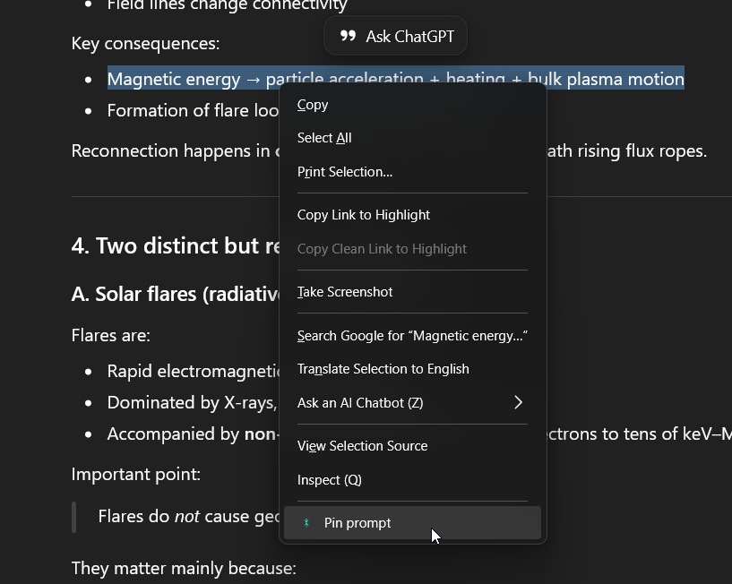
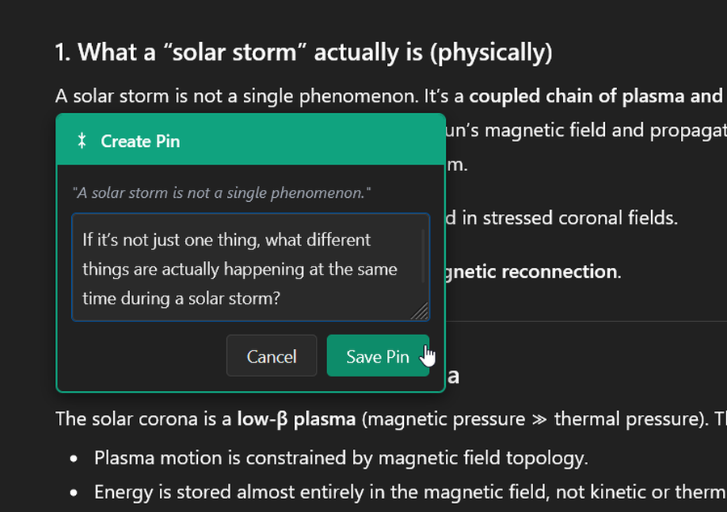
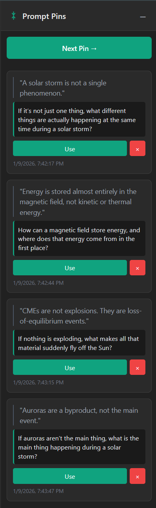

# Prompt Pins for ChatGPT

A Firefox extension that lets you save questions and prompts for later use
without breaking your conversational flow with ChatGPT.

## Features

- **Pin Any Text**: Highlight text in a ChatGPT conversation and right-click
  to pin it
- **Keyboard Shortcuts**: Use hotkeys for quick pin creation and usage
  (Ctrl+Alt+P, S, N)
- **Smart Queue System**: Automatically queues pins if ChatGPT is busy,
  submits when ready
- **Add Context**: Optionally add a note or comment to each pin
- **Quick Access**: Use the "Next Pin" button to automatically load and submit
  your next question
- **Drag to Reorder**: Organize your pins by dragging them into your preferred
  order
- **Clear All Pins**: Remove all pins at once with a confirmation dialog to
  prevent accidents
- **Persistent Storage**: Pins are saved locally and persist across browser
  sessions
- **Dark Theme**: Matches ChatGPT's interface with a clean, modern design
- **Auto-Submit**: Automatically submits prompts when you click "Use" or
  "Next Pin"

## Keyboard Shortcuts

### `Ctrl+Alt+P` - Create Pin

- Highlight any text in the ChatGPT interface
- Press `Ctrl+Alt+P` (or `Cmd+Alt+P` on Mac)
- Opens the pin creation dialog where you can add optional notes
- Same as right-clicking and selecting "Pin prompt"

### `Ctrl+Alt+S` - Send Immediately

- Highlight any text in the ChatGPT interface
- Press `Ctrl+Alt+S` (or `Cmd+Alt+S` on Mac)
- Sends the text directly to ChatGPT with "Expand on:" prefix
- Perfect for quick questions without creating a pin

### `Ctrl+Alt+N` - Use Next Pin

- Press `Ctrl+Alt+N` (or `Cmd+Alt+N` on Mac) from anywhere on the page
- Uses the first pin in your queue (same as clicking "Next Pin ->")
- Pin is automatically submitted and removed from the list
- Works even when the sidebar is collapsed

### Customizing Shortcuts

You can customize these keyboard shortcuts in Firefox:

1. Navigate to `about:addons`
2. Click the gear icon and select "Manage Extension Shortcuts"
3. Find "Prompt Pins for ChatGPT" and modify the shortcuts to your preference

## Smart Queue System

If you try to use a pin while ChatGPT is generating a response, the extension
intelligently handles this:

1. **Automatic Queuing**: The pin enters a queued state instead of failing
2. **Visual Feedback**: Shows "⏳ Queued - waiting for ChatGPT to finish..."
   badge
3. **Other Pins Disabled**: All other "Use" buttons become disabled while a
   pin is queued
4. **Cancel Option**: Click "Cancel" on the queued pin to abort and clear the
   input
5. **Auto-Submit**: Extension watches for ChatGPT to finish, then auto-submits
   the queued pin
6. **Auto-Delete**: Queued pin is deleted after successful submission

This ensures you never lose a pin due to timing issues and creates a smooth
workflow!

## Privacy

**No data collection. Period.**

All pins are stored locally in your browser using Firefox's storage API.
Nothing is transmitted to external servers. No analytics, no tracking, no
telemetry.

See [PRIVACY.md](PRIVACY.md) for full details.

## Installation

### From Firefox Add-ons (Recommended)

1. Visit the
   [Firefox Add-ons page](https://addons.mozilla.org/firefox/addon/prompt-pins-for-chatgpt/)
2. Click "Add to Firefox"
3. Click "Add" when prompted to confirm
4. Visit [ChatGPT](https://chatgpt.com) and start using Prompt Pins!

### From Source (for developers)

If you want to modify the code or contribute:

1. Clone this repository:

   ```bash
   git clone https://github.com/BigLangerStyle/prompt-pins-chatgpt.git
   cd prompt-pins-chatgpt
   ```

2. Load in Firefox:
   - Open Firefox and navigate to `about:debugging`
   - Click "This Firefox" in the left sidebar
   - Click "Load Temporary Add-on"
   - Select the `manifest.json` file from the extension directory

## Usage

### Creating Pins

#### Right-click menu

1. Highlight any text in a ChatGPT conversation
2. Right-click and select **"Pin prompt"**
3. Optionally add a comment for context
4. Click **"Save Pin"** (or press Enter)

#### Keyboard shortcut

1. Highlight any text in a ChatGPT conversation
2. Press **`Ctrl+Alt+P`** (or `Cmd+Alt+P` on Mac)
3. Optionally add a comment for context
4. Click **"Save Pin"** (or press Enter)

### Sending Text Immediately

1. Highlight any text in a ChatGPT conversation
2. Press **`Ctrl+Alt+S`** (or `Cmd+Alt+S` on Mac)
3. Text is sent to ChatGPT with "Expand on:" prefix without creating a pin

### Using Pins

- **Next Pin Button**: Click "Next Pin ->" to use the first pin in your queue
- **Keyboard**: Press **`Ctrl+Alt+N`** (or `Cmd+Alt+N` on Mac) to use the
  next pin
- **Individual Use**: Click "Use" on any specific pin
- If ChatGPT is busy, the pin automatically queues and submits when ready
- Pins are automatically submitted to ChatGPT and removed after use

### Managing Your Pins

- **Reorder**: Drag and drop pins to organize them
- **Delete**: Click the × button to remove a pin
- **Clear All**: Click "Clear" button to remove all pins (with confirmation)
- **Collapse**: Click the - button to hide the sidebar
- **Cancel Queue**: If a pin is queued, click "Cancel" to abort

## Permissions Explained

- **storage**: Save your pins locally in the browser
- **contextMenus**: Add "Pin prompt" to the right-click menu
- **Access to chat.openai.com and chatgpt.com**: Required to interact with
  ChatGPT's interface

## Technical Details

- **Language**: Vanilla JavaScript (no frameworks)
- **Size**: ~28KB total
- **Dependencies**: None (uses browser native APIs only)
- **Content script**: Only runs on ChatGPT domains
- **Security**: No external network requests, uses `textContent` (not
  `innerHTML`)

## Screenshots

### Pin Creation via Context Menu

Right-click on selected text and choose "Pin prompt" from the context menu:



### Pin Creation Dialog

Add optional notes or comments to your pin:



### Pin Management Sidebar

View and manage all your saved pins in the sidebar:



## Contributing

Suggestions and bug reports are welcome!

- **Report a Bug**: [Open an
  issue](https://github.com/BigLangerStyle/prompt-pins-chatgpt/issues)
- **Suggest a Feature**: [Open an
  issue](https://github.com/BigLangerStyle/prompt-pins-chatgpt/issues)

## License

MIT License - see [LICENSE](LICENSE) file for details

Copyright (c) 2025 Prompt Pins Contributors

## Version History

### 1.1.0 (January 11, 2025)

- **NEW:** Keyboard shortcuts
  - `Ctrl+Alt+P` - Create a pin from selected text
  - `Ctrl+Alt+S` - Send selected text immediately with "Expand on:" prefix
  - `Ctrl+Alt+N` - Use the next pin in queue
- **NEW:** Smart Queue System - Automatically queues pins when ChatGPT is busy
- **NEW:** Clear All Pins feature with confirmation dialog
- **NEW:** Chat-aware pins - Pins track which chat they came from and are visually distinguished when viewing in different chats
- **IMPROVED:** Pins without comments now use "Expand on:" prefix
- **IMPROVED:** Pins with comments use "Regarding:" prefix for better context
- **IMPROVED:** Code optimization - Eliminated duplication, added helper functions, improved maintainability
- **FIXED:** Collapsed sidebar button now properly centered and visible

### 1.0.0 (January 7, 2025)

- Initial release
- Pin creation with optional comments
- Drag to reorder functionality
- Auto-submit functionality
- Dark theme matching ChatGPT
- Local storage persistence
