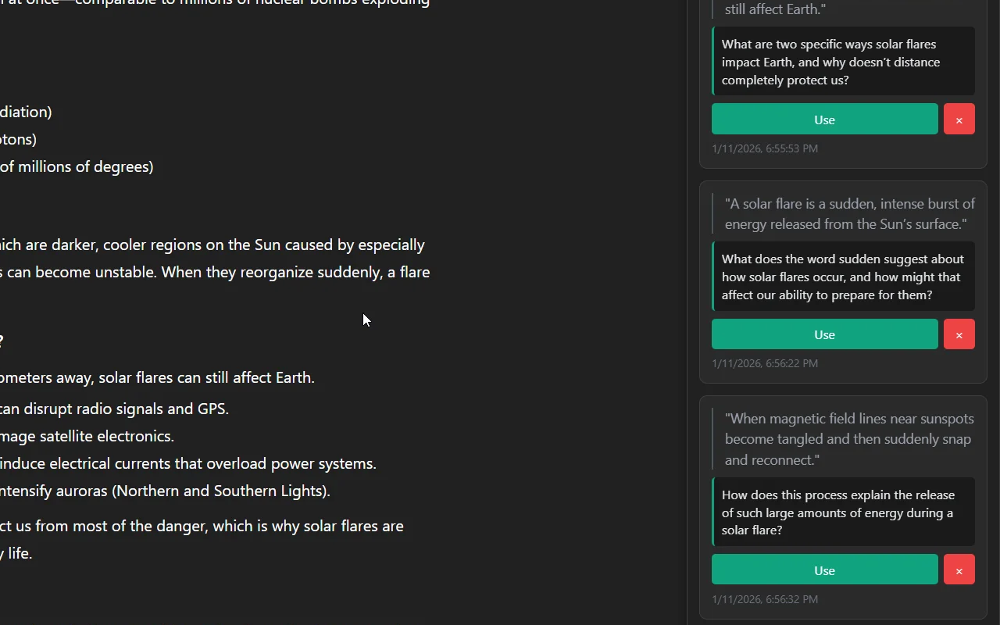

# Prompt Pins for ChatGPT

A browser extension for Firefox and Chrome that lets you save questions and prompts for later use without breaking your conversational flow with ChatGPT.

## Features

- **Pin Any Text**: Highlight text in a ChatGPT conversation and right-click to pin it
- **Keyboard Shortcuts**: Use hotkeys for quick pin creation and usage
- **Smart Queue System**: Automatically queues pins if ChatGPT is busy, submits when ready
- **Add Context**: Optionally add a note or comment to each pin
- **Quick Access**: Use the "Next Pin" button to automatically load and submit your next question
- **Drag to Reorder**: Organize your pins by dragging them into your preferred order
- **Clear All Pins**: Remove all pins at once with a confirmation dialog to prevent accidents
- **Persistent Storage**: Pins are saved locally and persist across browser sessions
- **Dark Theme**: Matches ChatGPT's interface with a clean, modern design
- **Auto-Submit**: Automatically submits prompts when you click "Use" or "Next Pin"

## Browser Support

- **Firefox**: Full support (Manifest V2)
- **Chrome/Edge**: Full support (Manifest V3)

## Known Issues

- ⚠️ **Chrome/Edge Keyboard Shortcuts**: Shortcuts like `Ctrl+Shift+P`, `Ctrl+Shift+S`, and `Ctrl+Shift+N` are currently non-functional in the Chrome/Edge version. This is a known issue being investigated.
- 🐛 **Double Panel (Chrome)**: Two sidebar panels may appear in Chrome. Minimizing one reveals another behind it.
- 🐛 **Login Layout Issue**: The sidebar covers the "Log in" button when not logged in. The sidebar should automatically minimize when the login screen is detected.


## Installation

### From Browser Extension Stores (Recommended)

**Firefox:**
1. Visit the [Firefox Add-ons page](https://addons.mozilla.org/en-US/firefox/addon/prompt-pins-for-chatgpt/)
2. Click "Add to Firefox"
3. Visit [ChatGPT](https://chatgpt.com) and start using Prompt Pins!

**Chrome/Edge:**
1. Visit the [Chrome Web Store page](https://chromewebstore.google.com/detail/prompt-pins-for-chatgpt/jnackadbafdgahcamdegljmjckfnppoi)
2. Click "Add to Chrome" or "Get" (for Edge)
3. Visit [ChatGPT](https://chatgpt.com) and start using Prompt Pins!

### From Source (for developers)

#### Building the Extension

1. Clone this repository:
   ```bash
   git clone https://github.com/BigLangerStyle/prompt-pins-chatgpt.git
   cd prompt-pins-chatgpt
   ```

2. Build for your browser:
   ```bash
   # Build for Firefox
   npm run build:firefox
   
   # Build for Chrome
   npm run build:chrome
   
   # Build for both
   npm run build:all
   ```

#### Loading in Firefox

1. Build the Firefox version: `npm run build:firefox`
2. Open Firefox and navigate to `about:debugging`
3. Click "This Firefox" in the left sidebar
4. Click "Load Temporary Add-on"
5. Select `manifest.json` from the `build/firefox/` directory

#### Loading in Chrome/Edge

1. Build the Chrome version: `npm run build:chrome`
2. Open Chrome and navigate to `chrome://extensions`
3. Enable "Developer mode" (toggle in top right)
4. Click "Load unpacked"
5. Select the `build/chrome/` directory

## Keyboard Shortcuts

### Firefox Shortcuts

- **`Ctrl+Alt+P`** (or `Cmd+Alt+P` on Mac) - Create a pin from selected text
- **`Ctrl+Alt+S`** (or `Cmd+Alt+S` on Mac) - Send selected text immediately with "Expand on:" prefix
- **`Ctrl+Alt+N`** (or `Cmd+Alt+N` on Mac) - Use the next pin in queue

### Chrome/Edge Shortcuts

- **`Ctrl+Shift+P`** (or `Cmd+Shift+P` on Mac) - Create a pin from selected text
- **`Ctrl+Shift+S`** (or `Cmd+Shift+S` on Mac) - Send selected text immediately with "Expand on:" prefix
- **`Ctrl+Shift+N`** (or `Cmd+Shift+N` on Mac) - Use the next pin in queue

> **Note:** Chrome doesn't support `Ctrl+Alt` shortcuts, so Chrome/Edge uses `Ctrl+Shift` instead.

### Customizing Shortcuts

**Firefox:**
1. Navigate to `about:addons`
2. Click the gear icon and select "Manage Extension Shortcuts"
3. Find "Prompt Pins for ChatGPT" and modify the shortcuts to your preference

**Chrome:**
1. Navigate to `chrome://extensions/shortcuts`
2. Find "Prompt Pins for ChatGPT"
3. Click the edit icon to customize shortcuts

## Smart Queue System

If you try to use a pin while ChatGPT is generating a response, the extension intelligently handles this:

1. **Automatic Queuing**: The pin enters a queued state instead of failing
2. **Visual Feedback**: Shows "⏳ Queued - waiting for ChatGPT to finish..." badge
3. **Other Pins Disabled**: All other "Use" buttons become disabled while a pin is queued
4. **Cancel Option**: Click "Cancel" on the queued pin to abort and clear the input
5. **Auto-Submit**: Extension watches for ChatGPT to finish, then auto-submits the queued pin
6. **Auto-Delete**: Queued pin is deleted after successful submission

This ensures you never lose a pin due to timing issues and creates a smooth workflow!

## Privacy

**No data collection. Period.**

All pins are stored locally in your browser. Nothing is transmitted to external servers. No analytics, no tracking, no telemetry.

See [PRIVACY.md](PRIVACY.md) for full details.

## Usage

### Creating Pins

**Right-click menu:**
1. Highlight any text in a ChatGPT conversation
2. Right-click and select **"Pin prompt"**
3. Optionally add a comment for context
4. Click **"Save Pin"** (or press Enter)

**Keyboard shortcut:**
1. Highlight any text in a ChatGPT conversation
2. Press the keyboard shortcut for your browser (see Keyboard Shortcuts section)
3. Optionally add a comment for context
4. Click **"Save Pin"** (or press Enter)

### Sending Text Immediately

1. Highlight any text in a ChatGPT conversation
2. Press the send-immediately shortcut for your browser
3. Text is sent to ChatGPT with "Expand on:" prefix without creating a pin

### Using Pins

- **Next Pin Button**: Click "Next Pin ->" to use the first pin in your queue
- **Keyboard**: Press the use-next-pin shortcut for your browser
- **Individual Use**: Click "Use" on any specific pin
- If ChatGPT is busy, the pin automatically queues and submits when ready
- Pins are automatically submitted to ChatGPT and removed after use

### Managing Your Pins

- **Reorder**: Drag and drop pins to organize them
- **Delete**: Click the × button to remove a pin
- **Clear All**: Click "Clear" button to remove all pins (with confirmation)
- **Collapse**: Click the - button to hide the sidebar
- **Cancel Queue**: If a pin is queued, click "Cancel" to abort

## Permissions Explained

- **storage**: Save your pins locally in the browser
- **contextMenus**: Add "Pin prompt" to the right-click menu
- **Access to chat.openai.com and chatgpt.com**: Required to interact with ChatGPT's interface

## Development

### Project Structure

```
prompt-pins-chatgpt/
├── src/                    # Shared source code
│   ├── background.js       # Background service worker
│   ├── content.js          # Content script (runs on ChatGPT)
│   ├── sidebar.css         # Sidebar styles
│   └── icons/              # Extension icons
├── firefox/                # Firefox-specific files
│   ├── manifest.json       # Firefox manifest (Manifest V2)
│   └── .web-ext-config.cjs # web-ext configuration
├── chrome/                 # Chrome-specific files
│   └── manifest.json       # Chrome manifest (Manifest V3)
├── scripts/                # Build scripts
│   ├── build-firefox.js    # Firefox build script
│   ├── build-chrome.js     # Chrome build script
│   └── clean.js            # Clean build directory
├── build/                  # Build output (gitignored)
│   ├── firefox/            # Built Firefox extension
│   └── chrome/             # Built Chrome extension
└── package.json            # NPM scripts
```

### Build Scripts

- `npm run build:firefox` - Build Firefox extension to `build/firefox/`
- `npm run build:chrome` - Build Chrome extension to `build/chrome/`
- `npm run build:all` - Build both versions
- `npm run clean` - Clean build directory
- `npm run dev:firefox` - Run Firefox extension in development mode

### Technical Details

- **Language**: Vanilla JavaScript (no frameworks)
- **Size**: ~28KB total
- **Dependencies**: None (uses browser native APIs only)
- **Content script**: Only runs on ChatGPT domains
- **Security**: No external network requests, uses `textContent` (not `innerHTML`)
- **API Compatibility**: Build system automatically converts `browser.*` to `chrome.*` for Chrome

## Screenshots

### Pin Creation via Context Menu

Right-click on selected text and choose "Pin prompt" from the context menu:


### Pin Creation Dialog

Add optional notes or comments to your pin:


### Pin Management Sidebar

View and manage all your saved pins in the sidebar:



## Contributing

Suggestions and bug reports are welcome!

- **Report a Bug**: [Open an issue](https://github.com/BigLangerStyle/prompt-pins-chatgpt/issues)
- **Suggest a Feature**: [Open an issue](https://github.com/BigLangerStyle/prompt-pins-chatgpt/issues)

## License

MIT License - see [LICENSE](LICENSE) file for details

Copyright (c) 2025 Prompt Pins Contributors

## Version History

### 1.1.1 (January 11, 2025)

- **CRITICAL FIX:** Context menu "Pin prompt" now appears reliably after browser restart
- **FIXED:** Added browser startup listener to recreate context menu when Firefox starts
- **FIXED:** Firefox minimum version set to 142.0 (supports data_collection_permissions on both desktop and Android)
- **FIXED:** Icon paths corrected in Firefox manifest
- **FIXED:** Chrome keyboard shortcuts changed to Ctrl+Shift (Chrome doesn't support Ctrl+Alt)
- **IMPROVED:** Better error handling and logging for debugging
- **NEW:** Chrome/Edge support with Manifest V3
- **NEW:** Monorepo structure with automated build system

### 1.1.0 (January 11, 2025)

- **NEW:** Keyboard shortcuts
  - `Ctrl+Alt+P` - Create a pin from selected text
  - `Ctrl+Alt+S` - Send selected text immediately with "Expand on:" prefix
  - `Ctrl+Alt+N` - Use the next pin in queue
- **NEW:** Smart Queue System - Automatically queues pins when ChatGPT is busy
- **NEW:** Clear All Pins feature with confirmation dialog
- **NEW:** Chat-aware pins - Pins track which chat they came from and are visually distinguished when viewing in different chats
- **IMPROVED:** Pins without comments now use "Expand on:" prefix
- **IMPROVED:** Pins with comments use "Regarding:" prefix for better context
- **IMPROVED:** Code optimization - Eliminated duplication, added helper functions, improved maintainability
- **FIXED:** Collapsed sidebar button now properly centered and visible

### 1.0.0 (January 7, 2025)

- Initial release
- Pin creation with optional comments
- Drag to reorder functionality
- Auto-submit functionality
- Dark theme matching ChatGPT
- Local storage persistence
