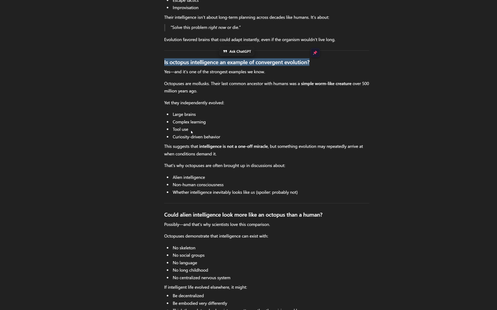
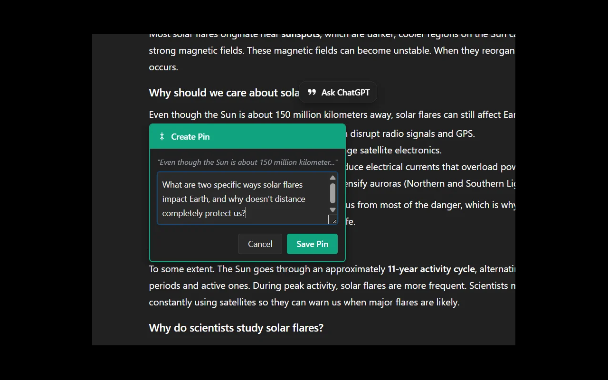

# Prompt Pins for ChatGPT

Save questions and prompts for later without breaking your conversation flow. Available for Firefox and Chrome.

[](https://addons.mozilla.org/en-US/firefox/addon/prompt-pins-for-chatgpt/)
[](https://chromewebstore.google.com/detail/prompt-pins-for-chatgpt/jnackadbafdgahcamdegljmjckfnppoi)

## What It Does

Prompt Pins lets you bookmark questions and prompts while chatting with ChatGPT. Pin text you want to explore later, organize your thoughts in a queue, and submit them when you're ready—all without losing your place in the conversation.

**Key Benefits:**
- Save interesting tangents without derailing your current conversation
- Build a queue of follow-up questions as they come to you
- Organize prompts by priority with drag-and-drop
- Never forget that perfect follow-up question

## Installation

### Quick Install (Recommended)

**Firefox:** [Install from Firefox Add-ons](https://addons.mozilla.org/en-US/firefox/addon/prompt-pins-for-chatgpt/)

**Chrome/Edge:** [Install from Chrome Web Store](https://chromewebstore.google.com/detail/prompt-pins-for-chatgpt/jnackadbafdgahcamdegljmjckfnppoi)

### Developer Install

See the [Development](#development) section below for building from source.

## How to Use

### Creating Pins

**Method 1: Right-click menu**
1. Highlight text in your ChatGPT conversation
2. Right-click → **"Pin prompt"**
3. Add an optional note for context
4. Press Enter or click Save

**Method 2: Keyboard shortcut**
- Firefox: `Ctrl+Alt+P` (Mac: `Cmd+Alt+P`)
- Chrome: `Ctrl+Shift+K` (Mac: `Cmd+Shift+K`)

**Method 3: Manual creation**
- Click the **"+ New"** button in the sidebar
- Type your prompt directly

### Using Your Pins

- **Click "Use"** on any pin to submit it to ChatGPT
- **Click "Next Pin →"** to use the first pin in your queue
- **Drag pins** to reorder them by priority
- **Click ×** to delete individual pins
- **Click "Clear"** to remove all pins

### Quick Send (No Pin)

Want to submit text immediately without saving it?
- Firefox: `Ctrl+Alt+S` (Mac: `Cmd+Alt+S`)
- Chrome: `Ctrl+Shift+L` (Mac: `Cmd+Shift+L`)

The text will be sent with "Expand on:" prefix without creating a pin.

## Features

- **Smart Queue System** - If ChatGPT is busy, pins automatically queue and submit when ready
- **Cross-Chat Context** - Pins remember which conversation they came from
- **Inline Editing** - Click any pin to edit its text or comment
- **Persistent Storage** - All pins are saved locally and survive browser restarts
- **Keyboard-Friendly** - Full keyboard shortcut support with in-app help ([?] icon)
- **Privacy-First** - No data leaves your browser. Ever.

## Privacy

**Zero data collection.** All pins are stored locally in your browser using standard extension storage APIs. Nothing is transmitted to external servers. No analytics, no tracking, no telemetry.

See [PRIVACY.md](PRIVACY.md) for complete details.

## Keyboard Shortcuts

**💡 Tip:** Click the **[?]** icon in the sidebar to see all shortcuts for your browser.

### Firefox
- `Ctrl+Alt+P` (Mac: `Cmd+Alt+P`) - Create pin or open manual entry
- `Ctrl+Alt+S` (Mac: `Cmd+Alt+S`) - Send selected text immediately
- `Ctrl+Alt+N` (Mac: `Cmd+Alt+N`) - Use next pin

### Chrome/Edge
- `Ctrl+Shift+K` (Mac: `Cmd+Shift+K`) - Create pin or open manual entry
- `Ctrl+Shift+L` (Mac: `Cmd+Shift+L`) - Send selected text immediately
- `Ctrl+Shift+U` (Mac: `Cmd+Shift+U`) - Use next pin

> **Note:** Chrome shortcuts differ to avoid conflicts with built-in Chrome shortcuts.

### Customizing Shortcuts

**Firefox:** `about:addons` → Gear icon → "Manage Extension Shortcuts"

**Chrome:** `chrome://extensions/shortcuts` → Find "Prompt Pins"

## Known Issues

Currently no known issues! If you find any bugs, please [report them](https://github.com/BigLangerStyle/prompt-pins-chatgpt/issues).

## Screenshots

### Creating a Pin


### Create Pin Dialog


## Development

### Building from Source

```bash
# Clone the repository
git clone https://github.com/BigLangerStyle/prompt-pins-chatgpt.git
cd prompt-pins-chatgpt

# Build for Firefox
npm run build:firefox

# Build for Chrome
npm run build:chrome

# Build both
npm run build:all
```

### Loading Locally

**Firefox:**
1. Navigate to `about:debugging`
2. Click "This Firefox" → "Load Temporary Add-on"
3. Select `manifest.json` from `build/firefox/`

**Chrome:**
1. Navigate to `chrome://extensions`
2. Enable "Developer mode"
3. Click "Load unpacked" → Select `build/chrome/`

### Project Structure

```
src/                    # Shared source code
├── background.js       # Background service worker
├── content.js          # Content script
├── sidebar.css         # Styles
└── icons/              # Extension icons

firefox/                # Firefox manifest (V2)
chrome/                 # Chrome manifest (V3)
scripts/                # Build automation
build/                  # Build output (gitignored)
```

### Tech Stack

- **Language:** Vanilla JavaScript (no frameworks)
- **Size:** ~28KB total
- **Dependencies:** Zero external dependencies
- **Browser APIs:** Native extension APIs only
- **Security:** No external network requests, sanitized content handling

## Contributing

Found a bug or have a feature idea? [Open an issue](https://github.com/BigLangerStyle/prompt-pins-chatgpt/issues)!

## License

MIT License - See [LICENSE](LICENSE) for details

Copyright (c) 2025 Prompt Pins Contributors

---

## Release Notes

### Version 1.3.0 (February 6, 2026)

**Major Features:**
- **Auto-minimize sidebar** - Sidebar stays hidden until you need it, reducing screen clutter
- **Hover-to-expand** - Quick access by hovering over collapsed edge (400ms delay)
- **Pin/Unpin toggle** - Lock sidebar open or let it auto-hide (Windows taskbar pattern)
- **Smart Create Pin button** - One-click pin creation from collapsed state with text detection
- **Cross-chat warning** - Alerts when using pins from different conversations
- **Current-chat pin prioritization** - "Next Pin →" now uses pins from your current chat first

**Improvements:**
- Three-state sidebar mode system (first-time, unpinned, pinned)
- Smooth animations and asymmetric hover timing (fast open, patient close)
- Collapsed sidebar shows brand icon and expand chevrons
- Pin ordering fixed - current-chat pins always accessible first

### Version 1.2.1 (January 23, 2026)

**Updates:**
- **New extension icon** - Modern teal asterisk design with dark background
- **Help icon update** - Standard ℹ️ info icon replaces `[?]` in sidebar header

**Bug Fixes:**
- Fixed sidebar auto-collapse after keyboard shortcut pin creation
- Fixed cursor placement when clicking in inline edit textarea

### Version 1.2.0 (January 18-19, 2026)

**New Features**
- Auto-collapse behavior when creating pins with collapsed sidebar
- Welcome animation for first-time users
- Pin highlight animation for visual feedback
- Inline editing of pin text and comments
- Cross-chat pin naming shows source conversation
- Branded minimize button with Prompt Pins icon
- Keyboard shortcuts help UI with ⓘ info button (green, shows version)

**Bug Fixes**
- Firefox inline edit cursor positioning (draggable parent conflict resolved)
- Auto-collapse after keyboard shortcut pin creation (matches selection-based behavior)
- Login page sidebar no longer covers login button
- New users now see expanded sidebar after first login
- Header now properly aligns with ChatGPT's header
- Chrome keyboard shortcuts working (changed to K/L/U from P/S/N)
- Mac keyboard shortcuts added for both browsers
- Mozilla validation warning resolved (innerHTML security)

### Version 1.1.1 (January 11, 2025)

- Fixed context menu reliability after browser restart
- Added Chrome/Edge support with Manifest V3
- Fixed icon paths in Firefox manifest
- Improved error handling and logging

### Version 1.1.0 (January 11, 2025)

- Added keyboard shortcuts
- Implemented smart queue system
- Added clear all pins feature
- Chat-aware pins with visual distinction
- Improved prompt prefixes ("Expand on:" / "Regarding:")

### Version 1.0.0 (January 7, 2025)

- Initial release
- Pin creation with optional comments
- Drag to reorder functionality
- Auto-submit functionality
- Dark theme matching ChatGPT
